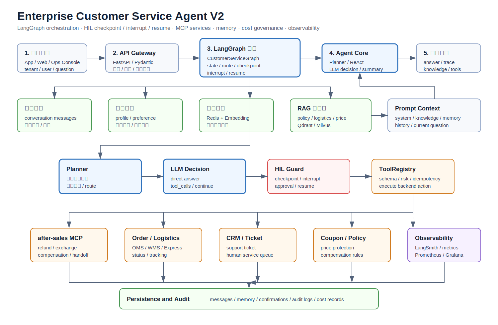

# Enterprise Customer Service Agent V2

一个面向企业售后客服场景的 AI Agent 后端项目，覆盖用户提问、意图理解、任务规划、知识库检索、短期/长期记忆、工具调用、人工确认、业务系统执行、链路追踪和结果落库的完整请求链路。

相比 V1 版本，V2 围绕 LangGraph 编排、HIL（checkpoint / interrupt / resume）、MCP 业务服务边界、短期与长期记忆、模型成本治理，以及观测与评估能力持续演进。

## 架构



核心运行链路：

```text
用户 / 运营台 / 业务前端
-> API Gateway / FastAPI
-> 请求校验、租户识别、限流、鉴权
-> LangGraph 客服状态图
   -> 加载短期会话记忆
   -> 读取长期用户记忆
   -> 用户问题标准化和意图识别
   -> Planner 拆分复杂任务
   -> RAG 检索售后知识库
   -> 根据成本策略选择模型
   -> 大模型首轮决策
      -> 直接回答
      -> 生成工具调用
      -> 触发人工确认中断
   -> ToolRegistry 执行业务工具
      -> MCP Client
      -> 售后 MCP 服务
      -> 订单 / 物流 / 工单 / 优惠券 / 搜索系统
   -> 大模型二次总结工具结果
   -> 写入消息、记忆、审计日志和指标
-> 返回答案、链路追踪、知识证据、工具结果、确认状态
```

核心原则是让大模型负责理解、推理和决策，让后端工具与 MCP 服务负责真实业务动作，并通过租户隔离、人工确认、幂等控制和审计日志约束高风险操作。

## 成本治理

V2 的成本治理目标不是简单拒绝服务，而是在租户日用量接近或超过预算时，动态调整运行策略，尽量保持客服链路可用：

- 降级模型时同步降低任务复杂度，减少复杂规划、多工具链和长推理，优先使用确定性规则完成可控判断。
- 低成本模型使用更明确的结构化提示词，降低模型自由发挥空间，提高意图识别和工具参数生成的稳定性。
- 工具调用继续使用严格参数校验，缺少订单号、原因、确认 token 等关键字段时先追问或中断，不直接执行业务动作。
- 对包含“这个、那个、刚才、上面”等模糊指代的问题，优先做问题改写或补充短期记忆，避免低成本模型误解上下文。
- 高风险动作不随模型降级而降低安全标准，退款、补偿、换货、转人工等操作仍然需要人工确认、幂等控制和审计记录。
- 成本策略同时调整模型、RAG 召回数量、历史窗口、rerank 和缓存优先级，而不是只替换一个更便宜的模型名称。

## 技术栈

- Python 3.11+
- FastAPI
- Pydantic v2
- SQLAlchemy 2.x Async ORM
- MySQL
- Redis
- Qdrant / Milvus
- LangGraph
- MCP Python SDK
- OpenAI-compatible Chat Completions API
- OpenAI-compatible Embeddings API
- LangSmith
- Prometheus / Grafana
- pytest
- ruff

## 项目结构

```text
enterprise-customer-service-agent-v2/
  Dockerfile
  docker-compose.yml
  pyproject.toml
  requirements.txt
  assets/
  sample_knowledge/
  scripts/
    check_env.py
    init_db.py
    seed_sample_data.py
    ingest_docs.py
    run_dev.py
    run_after_sales_mcp_server.py
  mcp_services/
    after_sales_server/
  src/customer_service_app/
    api/
    core/
    domain/
    infrastructure/
      cache/
      db/
      embeddings/
      llm/
      mcp/
      observability/
      search/
      vector_store/
    prompts/
    services/
    tools/
    workflows/
    web/
  tests/
```

## 配置

复制环境变量模板：

```bash
cp .env.example .env
```

主要配置：

```dotenv
APP_ENV=production
PUBLIC_API_BASE_URL=https://api.example.com
ALLOWED_ORIGINS=https://console.example.com

LLM_PROVIDER=openai_compatible
LLM_API_KEY=<your-llm-api-key>
LLM_BASE_URL=https://llm-provider.example.com/v1
LLM_MODEL=<chat-model-name>

EMBEDDING_PROVIDER=openai_compatible
EMBEDDING_API_KEY=<your-embedding-api-key>
EMBEDDING_BASE_URL=https://embedding-provider.example.com/v1
EMBEDDING_MODEL=<embedding-model-name>
EMBEDDING_DIMENSION=1024

DATABASE_URL=mysql+aiomysql://<user>:<password>@<mysql-host>:3306/<database>?charset=utf8mb4
REDIS_URL=redis://:<password>@<redis-host>:6379/0

VECTOR_STORE_PROVIDER=qdrant
QDRANT_URL=https://qdrant.example.com
QDRANT_API_KEY=<your-qdrant-api-key>
QDRANT_COLLECTION=customer_service_knowledge

MILVUS_URI=https://milvus.example.com
MILVUS_TOKEN=<your-milvus-token>
MILVUS_COLLECTION=customer_service_knowledge

MCP_AFTER_SALES_ENABLED=true
MCP_AFTER_SALES_URL=https://mcp-after-sales.example.com/mcp
MCP_APPROVAL_SIGNING_SECRET=<random-signing-secret>

LANGSMITH_TRACING=true
LANGSMITH_API_KEY=<your-langsmith-api-key>
PROMETHEUS_ENABLED=true
```

## 部署说明

主服务可以作为 FastAPI 应用部署，并依赖以下独立基础设施和业务服务：

- MySQL：保存会话、消息、订单、售后工单、确认记录、审计日志和长期记忆。
- Redis：承接语义缓存、运行锁、限流策略和轻量计数。
- Qdrant / Milvus：承接售后知识库向量检索。
- after-sales MCP service：提供订单、物流、退款、补偿、换货、转人工等业务能力。
- LangSmith / Prometheus / Grafana：提供链路追踪、指标、看板和运行分析。

典型启动顺序：

```bash
python scripts/check_env.py
python scripts/init_db.py
python scripts/seed_sample_data.py
python scripts/ingest_docs.py sample_knowledge --tenant-id <tenant-id>
python scripts/run_after_sales_mcp_server.py
uvicorn customer_service_app.main:app --host 0.0.0.0 --port <port>
```

容器化部署时，通过目标平台注入环境变量，并使用项目中的 Dockerfile 或 Compose 模板启动服务。

## MCP 服务

after-sales MCP 服务将售后能力暴露为独立治理的业务工具：

- `query_order_status`
- `query_logistics_status`
- `query_price_protection`
- `query_customer_profile`
- `create_refund_case`
- `create_compensation_case`
- `create_exchange_case`
- `transfer_to_human`

只读工具在完成租户和用户校验后可以直接执行。写入工具需要签名确认 token 和幂等键，避免同一个已确认动作被重复执行。

## API 示例

```bash
curl -X POST "https://api.example.com/api/v1/chat" \
  -H "Content-Type: application/json" \
  -d '{
    "tenant_id": "tenant_001",
    "user_id": "user_001",
    "conversation_id": null,
    "question": "我的订单 202606040001 已经签收了，但是商品有破损，我想申请退款或者补偿。",
    "history": [],
    "metadata": {}
  }'
```

## 测试

```bash
pytest -q
ruff check src tests scripts mcp_services/after_sales_server/src
```

## License

MIT
